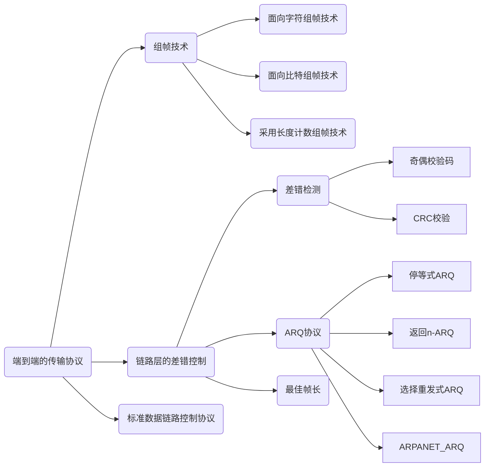

# 通网笔记

<!--more-->

写下通网笔记，顺便试着画下流程图

```mermaid
graph LR
O(端到端的传输协议)-->A(组帧技术)
O-->B(链路层的差错控制)
O-->C(标准数据链路控制协议)
A-->A1(面向字符组帧技术)
A-->A2(面向比特组帧技术)
A-->A3(采用长度计数组帧技术)
B-->B1(差错检测)
B-->B2(ARQ协议)
B-->B3(最佳帧长)
B1-->奇偶校验码
B1-->CRC校验
B2-->停等式ARQ
B2-->返回n-ARQ
B2-->选择重发式ARQ
B2-->ARPANET_ARQ

```

画这个好累……不画了`^

---

> 作者: 夜航星  
> URL: https://nightvoyageryhx.github.io/posts/%E9%80%9A%E7%BD%91%E7%AC%94%E8%AE%B0/  

